# ProgressBar

ProgressBar in terminal for deno

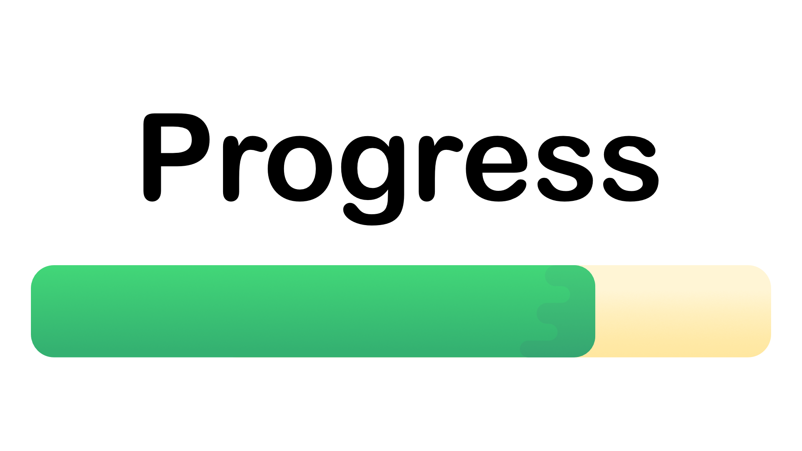

## Usage

### Multiple progress bars

#### example

```ts
import { MultiProgressBar } from "https://deno.land/x/progress@v1.4.1-writeAllSync/mod.ts";
import { delay } from "https://deno.land/std@0.210.0/async/delay.ts";

const title = "download files";
const total = 100;

const bars = new MultiProgressBar({
  title,
  // clear: true,
  complete: "=",
  incomplete: "-",
  display: "[:bar] :text :percent :time :completed/:total",
});

let completed1 = 0;
let completed2 = 0;

async function download() {
  while (completed1 <= total || completed2 <= total) {
    completed1 += 1;
    completed2 += 2;
    bars.render([
      {
        completed: completed1,
        total,
        text: "file1",
        // You can also change the style of the progress bar
        // complete: "*",
        // incomplete: ".",
      },
      { completed: completed2, total, text: "file2" },
    ]);

    await delay(50);
  }
}

await download();
```

#### interface

```ts
interface constructorOptions {
  title?: string;
  width?: number;
  complete?: string;
  incomplete?: string;
  clear?: boolean;
  interval?: number;
  display?: string;
  prettyTime?: boolean;
}

interface renderOptions {
  completed: number;
  text?: string;
  total?: number;
  complete?: string;
  incomplete?: string;
  prettyTimeOptions?: prettyTimeOptions;
}

/**
 * prettyTime options
 * @param withSpaces Whether to use spaces to separate times, `1d2h3m5s` or `1d 2h 3m 5s`, default false
 * @param toFixedVal value pass to toFixed for seconds, default 1
 * @param longFormat Whether to use a long format, default false, `1d2h3m5s` or `1days 2hours 3minutes 5seconds`
 */
interface prettyTimeOptions {
  withSpaces?: boolean;
  toFixedVal?: number;
  longFormat?: boolean;
}

class MultiProgressBar {
  /**
   * Title, total, complete, incomplete, can also be set or changed in the render method
   *
   * @param title Progress bar title, default: ''
   * @param width the displayed width of the progress, default: 50
   * @param complete completion character, default: colors.bgGreen(' '), can use any string
   * @param incomplete incomplete character, default: colors.bgWhite(' '), can use any string
   * @param clear  clear the bar on completion, default: false
   * @param interval  minimum time between updates in milliseconds, default: 16
   * @param display  What is displayed and display order, default: ':bar :text :percent :time :completed/:total'
   * @param prettyTime Whether to pretty print time and eta
   */
  constructor(options: ConstructorOptions);

  /**
   * "render" the progress bar
   *
   * @param bars progress bars
   * @param bars.completed` completed value
   * @param bars.total optional, total number of ticks to complete, default: 100
   * @param bars.text optional, text displayed per ProgressBar, default: ''
   * @param bars.complete optional, completion character
   * @param bars.incomplete optional, incomplete character
   * @param bars.prettyTimeOptions optional, prettyTime options
   */
  render(bars: Array<renderOptions>): void;

  /**
   * console: interrupt the progress bar and write a message above it
   *
   * @param message The message to write
   */
  console(message: string): void;

  /**
   * end: end a progress bar.
   * No need to call in most cases, unless you want to end before 100%
   */
  end(): void;
}
```

#### display

What is displayed and display order, default: ':bar :text :percent :time
:completed/:total'

- `:bar` the progress bar itself
- `:text` text displayed per ProgressBar
- `:percent` completion percentage
- `:time` time elapsed in seconds
- `:eta` estimated completion time in seconds
- `:total` total number of ticks to complete
- `:completed` completed value

### Single progress bar

#### simple example

```ts
import ProgressBar from "https://deno.land/x/progress@v1.4.1-writeAllSync/mod.ts";
import { delay } from "https://deno.land/std@0.210.0/async/delay.ts";

const title = "downloading:";
const total = 100;
const progress = new ProgressBar({
  title,
  total,
});
let completed = 0;
async function download() {
  while (completed <= total) {
    progress.render(completed++);

    await delay(50);
  }
}
await download();
```

#### complex example

```ts
import ProgressBar from "https://deno.land/x/progress@v1.4.1-writeAllSync/mod.ts";
import { delay } from "https://deno.land/std@0.210.0/async/delay.ts";

const total = 100;
const progress = new ProgressBar({
  total,
  complete: "=",
  incomplete: "-",
  display: ":completed/:total hello :time [:bar] :percent",
  // or =>
  // display: ':bar'
  // display: ':bar :time'
  // display: '[:bar]'
  // display: 'hello :bar world'
  // ...
});
let completed = 0;
async function download() {
  while (completed <= total) {
    progress.render(completed++);

    await delay(50);
  }
}
await download();
```

More examples in the `examples` folder.

#### interface

```ts
interface ConstructorOptions {
  title?: string,
  total?: number,
  width?: number,
  complete?: string,
  preciseBar?: string[],
  incomplete?: string,
  clear?: boolean,
  interval?: number,
  display?: string
  prettyTime?: boolean;
}

interface renderOptions {
  title?: string,
  total?: number,
  text?: string;
  complete?: string,
  preciseBar?: string[],
  incomplete?: string,
  prettyTimeOptions?: prettyTimeOptions;
}

/**
 * prettyTime options
 * @param withSpaces Whether to use spaces to separate times, `1d2h3m5s` or `1d 2h 3m 5s`, default false
 * @param toFixedVal value pass to toFixed for seconds, default 1
 * @param longFormat Whether to use a long format, default false, `1d2h3m5s` or `1days 2hours 3minutes 5seconds`
 */
interface prettyTimeOptions {
  withSpaces?: boolean;
  toFixedVal?: number;
  longFormat?: boolean;
}

class ProgressBar {
  /**
   * Title, total, complete, incomplete, can also be set or changed in the render method
   *
   * @param title progress bar title, default: ''
   * @param total total number of ticks to complete
   * @param width the displayed width of the progress, default: 50
   * @param complete completion character, default: colors.bgGreen(' '), can use any string
   * @param preciseBar in between character, default: [colors.bgGreen(' ')], can use any string array
   * @param incomplete incomplete character, default: colors.bgWhite(' '), can use any string
   * @param clear  clear the bar on completion, default: false
   * @param interval  minimum time between updates in milliseconds, default: 16
   * @param display  What is displayed and display order, default: ':title :percent :bar :time :completed/:total'
   * @param prettyTime Whether to pretty print time and eta
   */
  constructor(options: ConstructorOptions): void;

  /**
   * render: render the progress bar
   *
   * @param completed completed value
   * @param options optional parameters
   * @param options.title optional, progress bar title
   * @param options.text optional, custom text, default: ''
   * @param options.total optional, total number of ticks to complete, default: 100
   * @param options.complete optional, completion character, If you want to change at a certain moment. For example, it turns red at 20%
   * @param options.incomplete optional, incomplete character, If you want to change at a certain moment. For example, it turns red at 20%
   * @param options.prettyTimeOptions optional, prettyTime options
   */
  render(completed: number, options? renderOptions): void;

  /**
   * console: interrupt the progress bar and write a message above it
   *
   * @param message The message to write
   */
  console(message: string): void;

  /**
   * end: end a progress bar.
   * No need to call in most cases, unless you want to end before 100%
   */
  end(): void;
}
```

#### display

What is displayed and display order, default: ':title :percent :bar :time
:completed/:total'

- `:title` progress bar title
- `:percent` completion percentage
- `:bar` the progress bar itself
- `:time` time elapsed in seconds
- `:eta` estimated completion time in seconds
- `:completed` completed value
- `:total` total number of ticks to complete

## Screenshots

Standard use


Multi-line progress bar output in terminal

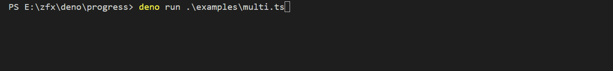

Change how the order and look of elements

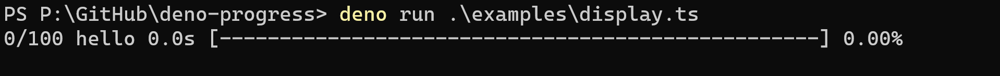

Change character color

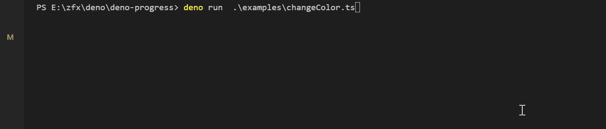

Change background color

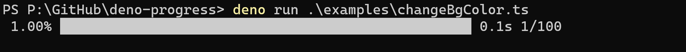

Color that changes with progress

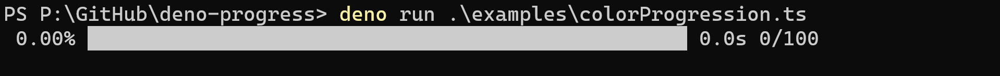

Precise bar with more intermediate states

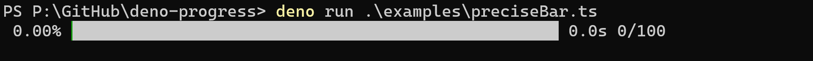

Wider bar

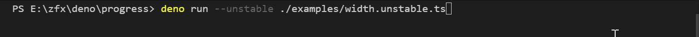

Clear the bar once finished

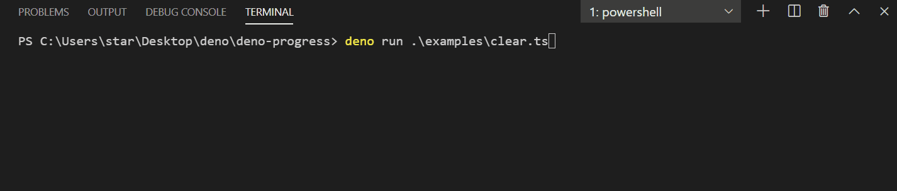

Backward progress

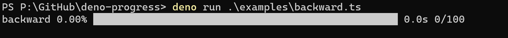

Log some messages

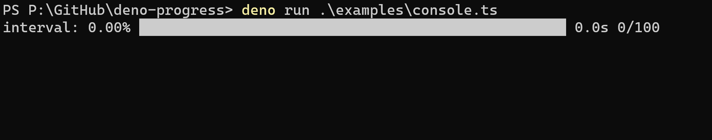

Log some messages next to the bar

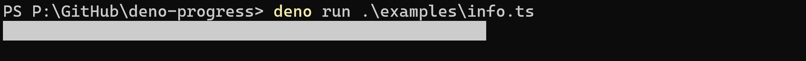

More screenshots in the `screenshots` folder.

## Changelog

[changelog](./changelog.md)
